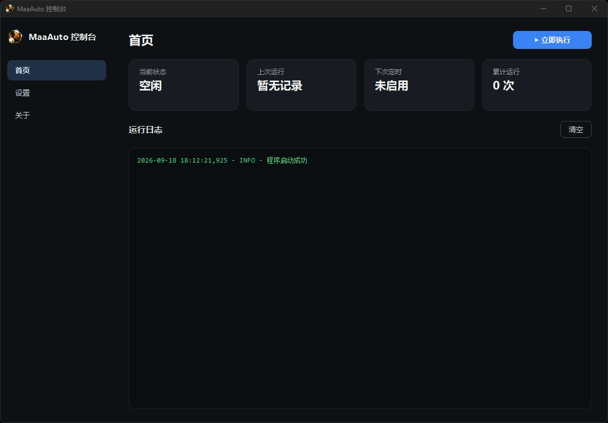
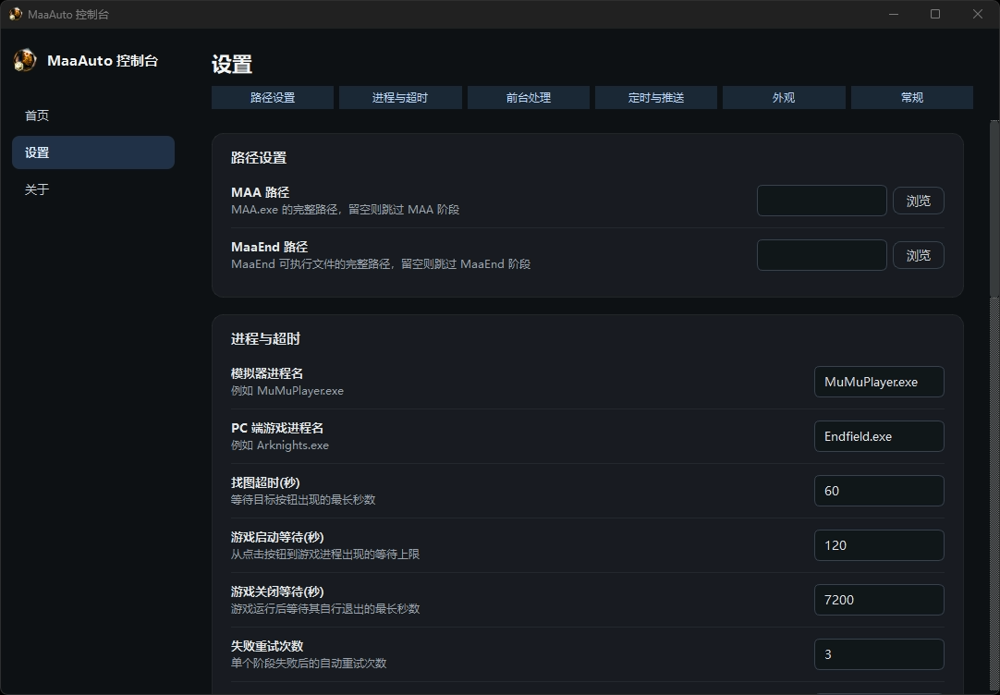
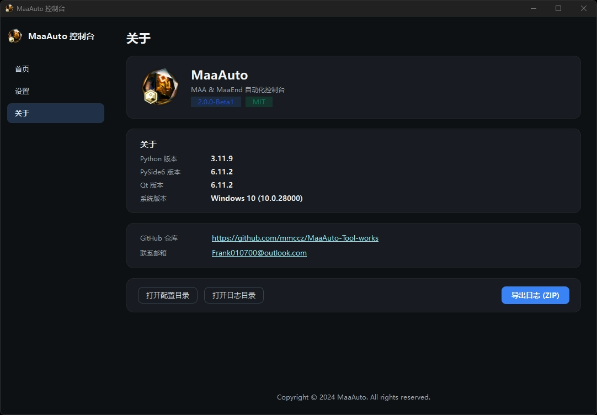

# MaaAuto - MAA & MaaEnd 定时自动化控制台

[](https://www.python.org/)
[](https://pypi.org/project/PySide6/)
[](LICENSE)

基于 **PySide6** 开发的 Windows 桌面自动化调度工具，用于统一管理 **MAA (MaaAssistantArknights)** 和 **MaaEnd**。支持每日定时、图像识别点击、可配置的前台处理策略、失败重试、Server酱 / 通用 Webhook / 系统通知三通道推送、**内置一键自动升级**，并提供浅色 / 深色 / 跟随系统三态主题与中英双语切换。

---

## ✨ 核心功能

### 自动化调度
- **每日定时启动**：自定义每日执行时间（默认关闭）。开启后若当天未执行，即使错过设定时间点，也会在下次启动时自动补执行一次。
- **图像识别点击**：基于 `pyautogui` + `opencv`，自动识别并点击 MAA 的「Link Start!」和 MaaEnd 的「开始任务」按钮。
- **灵活的前台处理策略**：启动前可选择
  1. **不做任何操作**（默认，最安全）
  2. **关闭所有前台程序**（较暴力，适合纯净挂机机）
  3. **仅关闭用户黑名单中的程序**（支持进程选择器可视化勾选）
- **重试与超时**：自定义重试次数、重试间隔、找图超时、游戏启动 / 关闭超时。
- **进程保活与唤醒**：任务完成后自动最小化 MAA / MaaEnd；下次执行时自动拉取到前台，拒绝多开。
- **随时中止**：任务执行中可点击「结束任务」或托盘菜单中止，长循环内 1 秒内响应，不残留子进程。

### 自动升级
- **一键升级**：关于页「检查更新」按钮，检测到新版本后可一键完成升级。
- **启动自动检查**：启动 5 秒后自动检查更新（可在设置中关闭）。
- **自动下载并升级**：勾选后检测到新版即自动升级（默认关闭，任务运行中会等任务结束再升级）。
- **进度可视化**：升级过程弹出进度窗口，展示下载、装依赖、打包、部署等各阶段进度。
- **失败回滚**：升级失败自动回滚到旧版本，并写入失败标记，下次启动弹出提示。
- **智能重启**：升级完成后自动重启主程序，恢复原启动方式（含 `--autostart`）。

### 推送通知
- **Server酱**：推送到微信，含完整任务日志。
- **通用 Webhook**：向自定义 URL POST `{title, content}`，可对接 Bark / Gotify / 企业微信机器人 / 钉钉 / 飞书等。
- **系统通知**：任务结束时弹出 Windows 托盘气泡（不含日志），可在设置页开关。

### 界面与体验
- **三页面结构**：首页（状态 + 日志） / 设置 / 关于，侧边栏导航 + 左右滑动切页动画。
- **三态主题**：浅色 / 深色 / 跟随系统，独立 QSS，切换带截图遮罩淡出过渡。
- **强调色自定义**：8 种预设色块 + 自定义取色器，实时生效。
- **中英双语**：JSON 语言包动态加载，切换即时生效。
- **背景图自定义**：支持透明度 / 模糊 / 4 种缩放模式（填充 / 适应 / 拉伸 / 平铺）。
- **全自动保存**：设置页所有改动即时落盘，无需手动保存。
- **窗口状态记忆**：窗口大小与位置自动持久化。
- **分类日志存储**：本地生成 `logs/年/月/日/run_次数_时间/task.log`，按执行次数分类。
- **日志上色**：ERROR 红 / WARNING 黄 / 成功绿 / 分隔线蓝，自动滚底，上限 2000 行。

---

## 🖼️ 界面预览

> 
> 主界面：状态卡片 + 立即执行 / 结束任务 + 实时日志

> 
> 设置界面：单页滚动 + 顶部 chips 跳转 + 分组卡片

> 
> 关于界面：版本信息 + 检查更新 + 打开目录 + 导出日志

---

## 正在制作的功能
- **1. 支持更多分辨率以及不同系统比例**
- **2. 优化识别结构**
- **3. 更多想法集结中...**

---

## 🚀 快速开始

### 1. 环境要求
- **操作系统**：Windows 10 / 11
- **屏幕分辨率**：推荐 1080P，系统缩放 **100%**（否则图像识别会失败，正在改善）
- **Python**：3.11 或更高版本
  - ⚠️ **不建议使用 Microsoft Store 版本**。其 `sys.executable` 指向一个转发器，会导致提权失败。推荐使用 [python.org](https://www.python.org/downloads/) 安装版。
- **依赖软件**：请自行下载并安装 [MAA](https://github.com/MaaAssistantArknights/MaaAssistantArknights) 和 [MaaEnd](https://github.com/MaaEnd/MaaEnd)。

### 2. 安装依赖或下载完整包
```bash
pip install -r requirements.txt
```
或直接到 [Releases](https://github.com/mmccz/MaaAuto-Tool-works/releases) 下载完整安装包。

### 3. 准备图像资源（重要）
在项目根目录创建 `resources` 文件夹，放入以下文件：

| 文件 | 说明 |
| ---- | ---- |
| `resources/icon.ico` | 应用图标（可选，缺失显示默认图标） |
| `resources/maa_start.png` | MAA 界面右下角「Link Start!」按钮 |
| `resources/maaend_start.png` | MaaEnd 界面下方「开始任务」按钮 |

**截图建议**：
- 在 100% 缩放的 1080P 屏幕下截图。
- 尽量只截按钮文字部分，不带背景，识别成功率最高。
- 如果程序报「找图超时」，请重新截图替换。

### 4. 运行
```bash
python main.py
```
首次运行会尝试提权（用于进程管理）。提权失败不会导致程序崩溃，会降级以普通权限继续运行。

启动后建议按以下顺序配置：
1. **设置 → 路径设置**：填入 MAA 路径、MaaEnd 路径（留空则跳过对应阶段）。
2. **设置 → 进程与超时**：填写模拟器进程名（默认 `MuMuPlayer.exe`）、PC 端游戏进程名（默认 `Endfield.exe`），按需调整超时 / 重试参数。
3. **设置 → 前台处理**：选择前台处理策略；如选择黑名单模式，可点「从进程列表选择」可视化勾选。
4. **设置 → 定时与推送**：
   - 勾选「启用每日定时启动」并设置时间。
   - 填写 Server酱 SendKey（可选）。
   - 填写通用 Webhook 地址（可选）。
   - 开关「启用系统通知」。
5. **设置 → 外观**：选择主题、强调色、语言、背景图。
6. **设置 → 常规**：开机自启、关闭行为、**自动检查更新**、**自动下载并升级**等。
7. 点击主界面 ▶️ **立即执行** 可手动触发一次任务。

---

## ⚙️ 配置说明
所有配置保存在 `config/config.json`，程序内修改即时生效。

| 字段 | 说明 | 默认值 |
| ---- | ---- | ---- |
| `maa_path` | MAA 可执行文件路径，留空跳过 MAA 阶段 | `""` |
| `maaend_path` | MaaEnd 可执行文件路径，留空跳过 MaaEnd 阶段 | `""` |
| `emulator_proc` | 模拟器进程名 | `MuMuPlayer.exe` |
| `pc_game_proc` | PC 端游戏进程名 | `Endfield.exe` |
| `foreground_action` | 前台处理策略：`none` / `kill_all` / `blacklist` | `none` |
| `blacklist_apps` | 黑名单进程名，逗号分隔 | `""` |
| `enable_schedule` | 是否启用每日定时启动 | `false` |
| `execute_time` | 每日执行时间（HH:mm） | `08:00` |
| `last_trigger_date` | 上次触发日期（防重复执行） | `""` |
| `run_count` | 累计运行次数 | `0` |
| `last_run_time` | 上次运行时间 | `""` |
| `serverchan_key` | Server酱 SendKey | `""` |
| `webhook_url` | 通用 Webhook 地址 | `""` |
| `enable_system_notify` | 任务结束时弹系统通知 | `true` |
| `wait_timeout` | 找图超时（秒） | `60` |
| `game_start_timeout` | 等待游戏启动超时（秒） | `120` |
| `game_exit_timeout` | 等待游戏关闭超时（秒） | `7200` |
| `retry_times` | 失败重试次数 | `3` |
| `retry_interval` | 重试间隔（秒） | `30` |
| `theme` | 主题：`light` / `dark` / `system` | `system` |
| `accent_color` | 强调色（十六进制） | `#3b82f6` |
| `language` | 语言：`zh_CN` / `en_US` | `zh_CN` |
| `background_image` | 背景图路径 | `""` |
| `background_opacity` | 背景图透明度（0~1） | `0.3` |
| `background_blur` | 背景模糊半径 | `0` |
| `background_mode` | 缩放模式：`cover` / `contain` / `stretch` / `tile` | `cover` |
| `show_animation` | 启用页面切换动画 | `true` |
| `auto_start` | 开机自启 | `false` |
| `minimize_to_tray` | 关闭 (X) 时最小化到托盘 | `true` |
| `kill_on_exit` | 退出程序时清理相关进程 | `true` |
| `auto_check_update` | 启动时自动检查更新 | `true` |
| `auto_download_update` | 自动下载并升级（静默） | `false` |
| `window_geometry` | 窗口位置大小（base64，自动保存） | `""` |

---

## 🔔 推送说明

### Server酱
填写 SendKey 后，任务结束会推送带日志的微信消息。设置页点「测试」可验证。

> ⚠️ 若 `serverchan_sdk.py` 缺失，主程序会正常启动，但推送功能会被禁用（设置页点「测试」会弹提示）。

### 通用 Webhook
向指定 URL POST：
```http
Content-Type: application/json

{
  "title": "09-18 | MaaAuto自动成功",
  "content": "任务开始时间：2026-09-18 08:00:00，任务结束时间：2026-09-18 10:23:45\n\n当前日志输出：\n...\n\nMaaAuto 敬上"
}
```

### 系统通知
任务结束时在 Windows 右下角弹出托盘气泡：
- **成功** → 任务执行成功
- **失败** → 任务执行失败，请查看日志
- **中止** → 任务已被中止

可在「设置 → 定时与推送 → 启用系统通知」中关闭。

---

## 🔄 升级说明

### 从 v2.0.1 升级到 v2.1.0
v2.0.1 内置的升级器为旧版本（占位版），**首次从 v2.0.1 升级到 v2.1.0 建议下载完整安装包手动覆盖**。安装到同一目录即可，`config/` 和 `logs/` 会自动保留。

### 从 v2.1.0 起
可以直接在程序内一键升级：
1. 侧边栏 → **关于** → 点 **「检查更新」**。
2. 检测到新版本后，按提示升级即可。

或者在 **设置 → 常规** 中：
- 开启「**启动时自动检查更新**」（默认开）—— 启动 5 秒后自动检查。
- 开启「**自动下载并升级（静默）**」—— 检测到新版自动升级，任务运行中会等任务结束再升级。

升级过程不影响 `config/` 和 `logs/`，用户数据和历史日志均保留。

---

## ⚠️ 关于「关闭所有前台程序」
仅当你主动选择该策略时才会触发。

该模式下，程序启动任务前会强制关闭所有可见窗口的前台程序（系统进程、模拟器、MAA、MaaEnd 等白名单除外）：
- **如果有未保存的 Word / Excel / 记事本 / 浏览器页面，数据将会丢失！**
- 建议仅在专门用于挂机游戏的纯净电脑上使用。

默认策略为 **「不做任何操作」**。因使用本软件导致的数据丢失、系统崩溃、游戏账号封禁等任何后果，作者不承担任何责任。

---

## 🛠️ 常见问题
**Q1：图像识别总是失败？**
确认系统缩放为 100%、分辨率 1080P，并重新截图 `resources/` 中的按钮图片。

**Q2：定时任务过了时间才打开软件，会执行吗？**
会。程序每 10 秒检查一次，只要当天未执行，超过设定时间后也会触发。

**Q3：为什么任务完成没有推送？**
分别检查 SendKey / Webhook 是否正确，并在设置页点击「测试」验证。

**Q4：MAA / MaaEnd 已经在运行，会重复启动吗？**
不会。程序会检测到已运行的进程并拉取到前台，避免多开。

**Q5：界面出来了但按钮点不动？**
可能是任务正在执行中。查看首页按钮是否显示「■ 结束任务」。如需中止，点击它或使用托盘菜单「结束任务」。

**Q6：如何完全退出程序？**
点击窗口右上角 X 是最小化到托盘。完全退出请右键托盘图标 → 退出 MaaAuto。

**Q7：使用 Microsoft Store 版 Python 启动后没有界面？**
商店版 Python 的提权机制有问题。解决方法：
- 换用 python.org 安装版 Python；
- 或用命令行 `python main.py --no-admin` 跳过提权启动。

**Q8：升级失败后主程序打不开？**
升级失败时会写入 `config/upgrade_failed.flag`，下次启动会弹出失败提示，关闭提示后文件自动删除，主程序可正常使用。如需修复请到 [Releases](https://github.com/mmccz/MaaAuto-Tool-works/releases) 下载最新版完整安装包。

**Q9：检查更新很慢或卡住？**
所有网络请求均在后台线程执行，不会阻塞界面。若长时间无响应，请检查网络连通性（GitHub API 在国内可能不稳定）。

**Q10：Server 酱推送测试提示「未加载 serverchan_sdk」？**
说明安装目录里缺少 `serverchan_sdk.py` 文件，请重新安装完整包，或改用通用 Webhook。

---

## ⚠️ 免责声明
- 本项目仅供学习 Python 自动化、GUI 开发、进程管理技术使用。
- 本项目为第三方调度工具，与 MAA、MaaEnd 官方无任何关联。
- 请勿将本软件用于商业用途。
- 使用本软件产生的任何直接或间接后果（包括但不限于游戏账号封禁、数据丢失、系统异常），由使用者自行承担。

---

## 📄 开源协议
本项目采用 **MIT License** 协议开源。