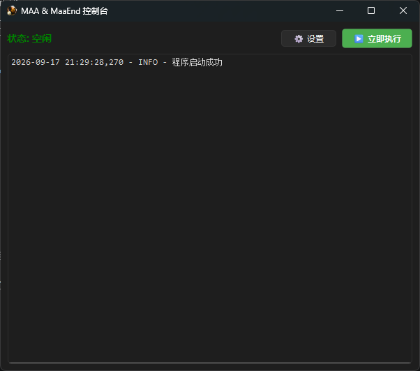
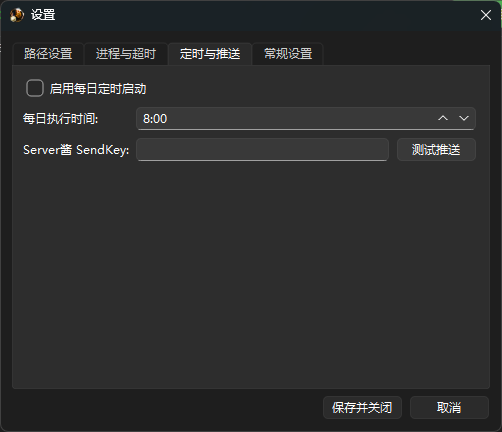

# MaaAuto - MAA & MaaEnd 定时自动化控制台

[](https://www.python.org/)
[](https://pypi.org/project/PySide6/)
[](LICENSE)

基于 PySide6 开发的 Windows 桌面自动化调度工具，用于统一管理 **MAA (MaaAssistantArknights)** 和 **MaaEnd**。支持定时启动、图像识别点击、可配置的前台处理策略、失败重试，以及 Server酱 / 通用 Webhook 双通道推送。

## ✨ 核心功能

- **每日定时启动**：自定义每日执行时间。**默认关闭**，需要你在设置里手动开启。开启后，只要当天还没执行过，即使错过了设定时间点（例如关机后重新打开），程序也会自动补执行一次。
- **图像识别点击**：基于 `pyautogui` 和 `opencv`，自动识别并点击 MAA 的 “Link Start!” 和 MaaEnd 的 “开始任务” 按钮。
- **灵活的前台处理策略**：启动前可选择 ——
  1. **关闭所有前台程序**（较暴力，适合纯净挂机机）
  2. **不做任何操作**（默认，最安全）
  3. **仅关闭用户黑名单中的程序**（按进程名模糊匹配）
- **重试与超时**：支持自定义重试次数、重试间隔、找图超时、游戏启动/关闭超时，任务卡死自动重试。
- **进程保活与唤醒**：任务完成后自动将 MAA/MaaEnd 最小化到后台；下次执行时自动拉取到前台，**拒绝重复启动导致的多开冲突**。
- **双通道推送**：
  - **Server酱**：推送到微信，适合手机端接收。
  - **通用 Webhook**：向自定义 URL POST JSON（`{title, content}`），可对接 Bark、Gotify、企业微信机器人、钉钉、飞书、自建服务等。
- **分类日志存储**：自动在本地生成 `logs/年份/月份/日期/run_次数_时间/task.log`，按执行次数分类，绝不重复输出。

## 🖼️ 界面预览

> 
> 
> 
> 主界面（状态监控 + 日志输出）
> 设置界面（路径、进程、前台处理、定时、推送分类管理）

## 🚀 快速开始

### 1. 环境要求

- **操作系统**：Windows 10 / 11（仅支持 Windows）
- **屏幕分辨率**：推荐 1080P，且系统缩放必须设置为 **100%**（否则图像识别会失败）（正在改善这一问题）
- **Python**：3.11 或更高版本
- **依赖软件**：请自行下载并安装 [MAA](https://github.com/MaaAssistantArknights/MaaAssistantArknights) 和 [MaaEnd](https://github.com/MaaEnd/MaaEnd)。

### 2. 安装依赖

```bash
pip install -r requirements.txt
```

`requirements.txt` 内容如下：

```text
PySide6
pyautogui
psutil
opencv-python
pywin32
serverchan-sdk
```

### 3. 准备图像资源（非常重要）

程序依赖图像识别来点击按钮。请在项目根目录创建 `resources` 文件夹，并自行截图以下两张图片放入其中：

- `resources/maa_start.png`：MAA 界面右下角的 “Link Start!” 按钮。
- `resources/maaend_start.png`：MaaEnd 界面下方的 “开始任务” 按钮。

**截图建议**：

- 在 100% 缩放的 1080P 屏幕下截图。
- 尽量只截取按钮的文字部分，不要带太多背景，这样识别成功率最高。
- 如果程序报错 “找图超时”，请重新截图并替换。

### 4. 配置与运行

直接运行源码：

```bash
python main.py
```

首次运行程序会自动请求管理员权限（用于进程管理）。启动后：

1. 点击右上角 **⚙️ 设置** → **路径设置**，填入 MAA 路径、MaaEnd 路径（留空则跳过对应阶段）。
2. 在 **进程与超时** 页填写模拟器进程名（默认 `MuMuPlayer.exe`）和 PC 端游戏进程名（默认 `Arknights.exe`），并按需调整超时/重试参数。
3. 在 **前台处理** 页选择启动前的前台程序处理策略（默认“不做任何操作”）。如选择黑名单模式，请填入要关闭的进程名，多个用逗号分隔（例如 `chrome.exe,notepad.exe,qq`）。
4. 在 **定时与推送** 页：
   - 勾选“启用每日定时启动”并设定时间（默认关闭）。
   - 填写 Server酱 SendKey（可选）。
   - 填写通用 Webhook 地址（可选），可点击“测试 Webhook”验证。
5. 保存配置。点击主界面 **▶️ 立即执行** 可手动触发一次任务。

## 📂 目录结构

```text
MaaAutoProject/
├── main.py                 # 程序入口与界面逻辑
├── config_manager.py       # 配置与日志管理
├── automation.py           # 核心自动化流程
├── process_utils.py        # 进程检测、清理与窗口控制
├── notifier.py             # Server酱 / 通用 Webhook 推送模块
├── settings_dialog.py      # 设置界面
├── utils.py                # 本地工具函数（资源路径、进程清理等）
├── requirements.txt        # 依赖清单
├── resources/              # 图像资源目录（需自行提供截图）
│   ├── icon.ico
│   ├── maa_start.png
│   └── maaend_start.png
├── config/                 # 自动生成：配置文件夹
└── logs/                   # 自动生成：日志文件夹
```

## ⚙️ 配置说明

所有配置保存在 `config/config.json`，可在程序内修改，也可手动编辑。主要字段：

| 字段                   | 说明                                                          | 默认值             |
| ---------------------- | ------------------------------------------------------------- | ------------------ |
| `maa_path`           | MAA 可执行文件路径，留空则跳过 MAA 阶段                       | `""`             |
| `maaend_path`        | MaaEnd 可执行文件路径，留空则跳过 MaaEnd 阶段                 | `""`             |
| `emulator_proc`      | 模拟器进程名（用于等待启动/关闭）                             | `MuMuPlayer.exe` |
| `pc_game_proc`       | PC 端游戏进程名                                               | `Arknights.exe`  |
| `foreground_action`  | 启动前的前台处理策略：`none` / `kill_all` / `blacklist` | `none`           |
| `blacklist_apps`     | 黑名单进程名，逗号分隔（仅`blacklist` 模式生效）            | `""`             |
| `enable_schedule`    | 是否启用每日定时启动                                          | `false`          |
| `execute_time`       | 每日执行时间（HH:mm）                                         | `08:00`          |
| `serverchan_key`     | Server酱 SendKey，留空则不推送                                | `""`             |
| `webhook_url`        | 通用 Webhook 地址，留空则不推送                               | `""`             |
| `wait_timeout`       | 找图超时（秒）                                                | `60`             |
| `game_start_timeout` | 等待游戏启动超时（秒）                                        | `120`            |
| `game_exit_timeout`  | 等待游戏关闭超时（秒）                                        | `7200`           |
| `retry_times`        | 失败重试次数                                                  | `3`              |
| `retry_interval`     | 重试间隔（秒）                                                | `30`             |
| `auto_start`         | 开机自启                                                      | `false`          |
| `minimize_to_tray`   | 点击关闭(X)时最小化到托盘                                     | `true`           |
| `kill_on_exit`       | 退出程序时强制清理所有相关进程                                | `true`           |

## 🔔 推送说明

### Server酱

填写 SendKey 后，任务结束会推送带日志的微信消息。可在设置页点击 **测试推送** 验证。

### 通用 Webhook

填写 Webhook 地址后，程序会向该地址发送 **POST** 请求：

```http
Content-Type: application/json
{
  "title": "03-15 | MaaAuto自动成功",
  "content": "任务开始时间：2026-03-15 08:00:00，任务结束时间：2026-03-15 10:23:45

当前日志输出：
...

MaaAuto 敬上"
}
```

可根据接收端格式自行转发/转换（例如企业微信机器人、钉钉、飞书等通常需要包一层壳，可在自建服务中做适配）。

## ⚠️ 关于“关闭所有前台程序”

**仅当你主动选择“关闭所有前台程序”策略时才会触发此行为。**

该模式下，程序在启动任务前会强制关闭所有**可见窗口**的前台程序（系统进程、模拟器、MAA、MaaEnd 等白名单除外）：

- 如果有未保存的 Word、Excel、记事本或浏览器页面，**数据将会丢失**！
- 建议在**专门用于挂机游戏的纯净电脑**上使用该模式。

默认策略为 **“不做任何操作”**，如果你担心误删数据，请保持默认，或使用“黑名单”模式精确指定要关闭的程序。

因使用本软件导致的数据丢失、系统崩溃、游戏账号封禁等任何后果，**作者不承担任何责任**。

## 🛠️ 常见问题

**Q：图像识别总是失败怎么办？**
A：确认系统缩放为 **100%**、分辨率为 1080P，并重新截图 `resources/` 中的按钮图片（尽量只截文字部分）。

**Q：定时任务过了时间才打开软件，会执行吗？**
A：会。程序每 10 秒检查一次，只要当天还没执行过，超过设定时间后也会触发一次。

**Q：为什么任务完成没有推送？**
A：请检查 SendKey / Webhook 是否填写正确，并分别在设置页点击“测试推送”/“测试 Webhook”验证。

**Q：MAA / MaaEnd 已经在运行，会重复启动吗？**
A：不会。程序会检测到已运行的进程并把它拉取到前台，避免多开。

## ⚠️ 免责声明

- 本项目仅供学习 Python 自动化、GUI 开发和进程管理技术使用。
- 本项目为第三方调度工具，与 MAA、MaaEnd 官方无任何关联。
- 请勿将本软件用于商业用途。
- 使用本软件产生的任何直接或间接后果（包括但不限于游戏账号封禁、数据丢失、系统异常），由使用者自行承担。

## 📄 开源协议

本项目采用 MIT License 协议开源。
